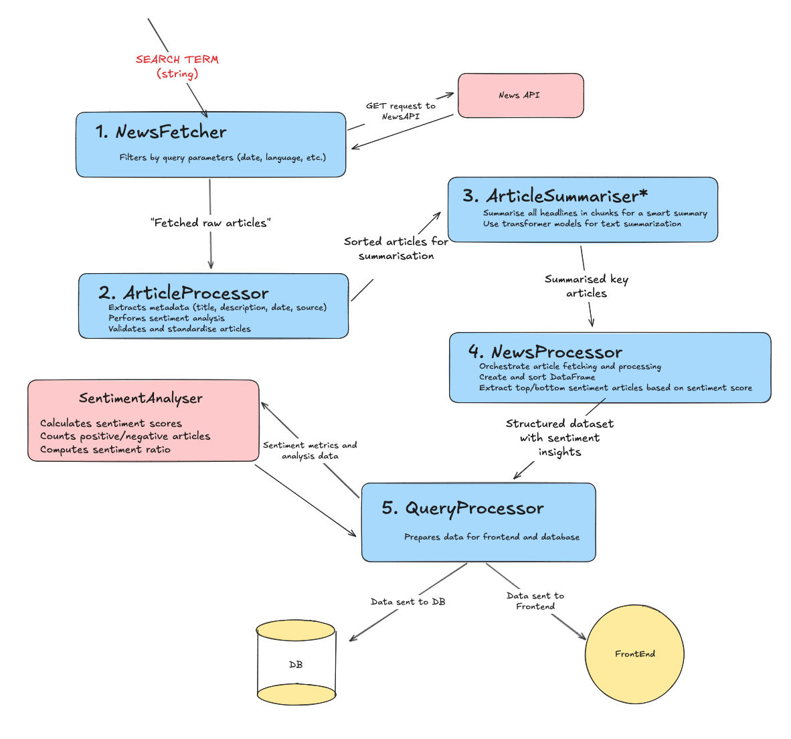

# SentimentPress Project by James Rumble

## Table of Contents
- [Journey](#journey)
- [Data Processing Flowchart](#data-processing-flowchart)
- [Workflow Overview](#workflow-overview)
  - [1. Fetching News Articles](#1-fetching-news-articles)
  - [2. Processing Individual Articles](#2-processing-individual-articles)
  - [3. Validating and Formatting Data](#3-validating-and-formatting-data)
  - [4. Summarisating Articles](#4-summarisating-articles)
  - [5. Structuring Data for Analysis](#5-structuring-data-for-analysis)
- [Tech Stack](#tech-stack)
- [Features](#features)
  - [Landing Page](#landing-page)
  - [Query Page](#query-page)
  - [Sentiment Over Time Chart](#sentiment-over-time-chart)
- [Database Schema](#database-schema)
  - [Tables Overview](#tables-overview)
  - [1. `search_metadata`](#1-search_metadata)
  - [2. `search_results`](#2-search_results)
  - [Why This Structure?](#why-this-structure)
- [Testing](#testing)
- [Caching and Optimisation](#caching-and-optimisation)
- [Design](#design)
- [Deployment](#deployment)
- [Future Improvements & Learnings](#future-improvements--learnings)
  - [Performance Optimisation](#performance-optimisation)
  - [Expanded Search Parameters](#expanded-search-parameters)
  - [Better Utilisation of NewsAPI](#better-utilisation-of-newsapi)
  - [Front-End Responsiveness](#front-end-responsiveness)
  - [User Authentication & Personalisation](#user-authentication--personalisation)
  - [Learnings & Challenges](#learnings--challenges)

## Journey
The idea for this project first came to me during my time at Makers Academy, where I wanted to work with the NewsAPI for our final group project. I saw it as a great way to showcase a wide range of full-stack skills, making it the perfect portfolio piece. Unfortunately, after a team vote, we went in a different direction and built Movie Heroes—a smart movie recommendation app.

After the bootcamp, the idea stuck with me. I partnered up with a good friend from Makers, and together we built a working prototype. But, as things often go, the final stages were left unfinished as we both moved on with our careers.

Recently, I decided to pick it up again—this time solo. Instead of continuing from the old repo, I started fresh, knowing I had learnt a lot since the first attempt. My goal was simple: allow users to search for a term, pull in 100 news articles, and analyse them for sentiment and summarisation—not necessarily solving a specific problem, but providing interesting insights while showcasing full-stack development and machine learning integration.

One of my key ambitions was full deployment, which came with its fair share of challenges. I chose AWS since I had recently completed the AWS Cloud Practitioner course and wanted to apply that knowledge in a real-world setting. However, budget constraints meant I had to scale down some aspects of the app, leading to tough decisions about optimisation and resource management.

While the limitations weren't ideal, they taught me a lot about performance, cost-efficient deployment, and thinking ahead in future projects. This journey has been full of ups and downs, but it has made me a better engineer—and that's what really matters.

## Data Processing Flowchart

## Workflow Overview

The SentimentPress pipeline processes news articles from NewsAPI to perform sentiment analysis and summarisation. Below is a step-by-step breakdown of the workflow.

### **1. Fetching News Articles**
We start by making an API call to **NewsAPI**, retrieving articles based on specified parameters like date range, keywords, and language.  
- **Limitation**: Due to the constraints of the **free-tier** of NewsAPI, we cannot access full article content—only metadata such as **titles, descriptions, sources, and timestamps**.  
- This significantly impacts sentiment analysis accuracy since article content would provide a richer dataset.

### **2. Processing Individual Articles**
Each article is processed to:
- Extract relevant metadata (**title, description, date, and source**).
- Perform **sentiment analysis** using a **Transformer-based model** (`distilbert-base-uncased-finetuned-sst-2-english`).
  - Sentiment is determined using **both** the article's title and description.
  - This model provides a probability score of the article being positive or negative.
  - **Note:** Sentiment analysis is CPU-intensive and slow. A **lighter model** may be considered for better performance.

### **3. Validating and Formatting Data**
- Articles are **validated** to ensure they haven't been deleted from the source (to prevent null results).
- The processed data is transformed into a **dictionary format**, making it easy to use for further processing.

### **4. Summarisating Articles**
To enhance readability, a **summarisation model** is applied to:
- Generate summaries for **top** and **bottom-scoring** articles.
- Create a high-level overview of the dataset.
- The summarization model is based on `distilbart-cnn-12-6`.

### **5. Structuring Data for Analysis**
Once articles are processed, they are stored in a structured format:
- **Sentiment Scores:** Used to rank articles by positivity/negativity.
- **Top/Bottom Articles:** Extracted based on sentiment scores.
- **Aggregated Sentiment Metrics:** Helps generate insights for the frontend.

## Tech Stack
Since Python is my primary language, I built the backend using Flask. In the original version of this project, we used MongoDB as our NoSQL database, but when I restarted the project, I switched to PostgreSQL. I made this decision partly to take advantage of SQL's powerful querying capabilities and partly to gain more hands-on experience with relational databases.

For the frontend, I used JavaScript with React and Node.js. This setup allowed me to separate concerns between the frontend and backend, keeping them modular and scalable. Using React made sense for building an interactive and dynamic UI, while Node.js helped streamline API calls and frontend logic.

To manage the backend and database efficiently, I used Docker and Docker Compose, ensuring a consistent development environment and simplifying deployment. For the frontend, I experimented with Terraform to deploy it to AWS S3, gaining valuable experience in Infrastructure as Code (IaC) and cloud deployment.

This stack provided a solid foundation for the project, balancing performance, flexibility, and learning opportunities.

## Features
The website consists of two main pages: the Landing Page and the Query Page.

### Landing Page
Users can search for a term, which triggers the backend workflow.
The page provides daily insights, including:
- The lowest and highest sentiment scores of the day.
- The most popular search term for the current day.
- A carousel of headlines and summaries from today's news.
- Users can either search their own query or select from a dropdown of popular news categories, which I have cached for the day (see Caching Section for details).

### Query Page
Displays key insights based on the search query:
- Overall sentiment score for the previous day.
- Total article count (not always 100 due to standardisation).
- Number of positive articles (sentiment score above 0).
- Number of negative articles (sentiment score below 0).
- A summarisation of the news for the given search term.
- Top 3 and bottom 3 articles for that day.

### Sentiment Over Time Chart (My Favourite Feature!)
- A dynamic chart on the left-hand side that tracks sentiment over time.
- Users can hover over each data point to see the summary for that day.
- Previous search data remains on the chart, allowing for interesting comparisons between different terms.
- The chart can also be viewed in full-screen mode for a better experience.

## **Database Schema**  

The **database** is structured to efficiently store **search metadata** and **search results**, ensuring that user queries and sentiment analysis data are well-organised and easily retrievable.  

### **Tables Overview**  

### **1. `search_metadata`** *(Tracks user searches)*  
This table stores metadata for each search query, allowing for **tracking search trends and user behaviour**.  

| Column Name          | Data Type                  | Description |
|----------------------|---------------------------|-------------|
| `search_metadata_id` | `SERIAL PRIMARY KEY`      | Unique ID for each search record. |
| `user_id`           | `INT`                      | (Future expansion) ID of the user who performed the search. |
| `search_term`       | `VARCHAR(255) NOT NULL`    | The term the user searched for. |
| `searched_at`       | `TIMESTAMP DEFAULT NOW()`  | Timestamp of when the search was made. |

### **2. `search_results`** *(Stores sentiment analysis results)*  
This table holds the **processed sentiment data** for each search term, enabling fast retrieval and historical tracking of news sentiment.  

| Column Name                 | Data Type                 | Description |
|-----------------------------|--------------------------|-------------|
| `search_result_id`          | `SERIAL PRIMARY KEY`     | Unique ID for each search result. |
| `search_term`               | `VARCHAR(255)`           | The search term queried. |
| `mean_sentiment`            | `DECIMAL(5,2)`           | The average sentiment score across all retrieved articles. |
| `positive_article_count`    | `INT`                    | Number of articles with a **positive** sentiment score (> 0). |
| `negative_article_count`    | `INT`                    | Number of articles with a **negative** sentiment score (< 0). |
| `total_article_count`       | `INT`                    | The total number of articles retrieved. |
| `ratio_positive_vs_negative` | `DECIMAL(5,2)`          | The ratio of **positive vs. negative** articles. |
| `main_headline`             | `VARCHAR(4000)`          | The most significant headline summarising the results. |
| `top_3_articles`            | `JSONB`                  | JSON object containing the **top 3 articles** based on sentiment. |
| `bottom_3_articles`         | `JSONB`                  | JSON object containing the **bottom 3 articles** based on sentiment. |
| `created_at`                | `TIMESTAMP DEFAULT NOW()` | Timestamp when the results were generated. |

### **Why This Structure?**  
- **Separation of concerns**: `search_metadata` tracks searches, while `search_results` stores processed sentiment data.  
- **Future scalability**: A `user_id` column is included for potential **user-based tracking** and account features.  
- **Fast retrieval**: Pre-processed sentiment data allows quick lookups instead of reprocessing queries every time.  
- **JSONB for flexibility**: Using **JSONB** for storing top and bottom articles keeps the schema adaptable for future enhancements.  

This schema ensures the **efficient storage, retrieval, and analysis** of sentiment trends over time.

## Testing
For testing, I used pytest to ensure my application's core functionality remained intact. I fully tested my repositories, covering both metadata handling and search result queries. The entire sentiment analysis workflow was also tested, with each component being validated separately.

To maintain reliability, I set up a GitHub workflow that automatically ran the test suite on every pull request, ensuring that no changes compromised the project's core functionality.

For database testing, I used a dedicated test database that was populated with dummy SQL data. Each test instance was torn down and reset before running a new test, keeping the environment clean and consistent.

## Caching and Optimisation
I'll admit, when I first built the logic for processing and analyzing articles, I didn't fully consider how much heavy lifting the backend would require. It quickly became clear that processing 100 titles and descriptions through a sentiment analysis and summarisation model at once was painfully slow. From a user perspective, this wasn't great, so I implemented a caching system to improve performance.

Now, if a user searches for a term that has already been queried that day, the system simply retrieves the results from the database instead of making another API call to NewsAPI. This avoids unnecessary requests and prevents repeated CPU- and memory-heavy processing.

To take this further, I created an automatic populator route, which runs at a set time every morning. This preloads the database with articles from common news categories (based on my own judgment). I later integrated these preloaded categories into a dropdown menu, encouraging users to select cached terms rather than triggering fresh searches.

As you'll see later, this automatic populator became the core of the stripped-down version of SentimentPress that I ultimately deployed. It was a key part of my workaround for a more cost-effective deployment solution.

## Design
I went with a base theme of black and purple, giving the app a sleek and modern feel. For the app logo, I incorporated a spinning globe using @react-three/fiber and @react-three/drei, which I felt was a great visual representation of the news constantly updating.

I also made use of React Icons and implemented a React D3-speedometer to display sentiment analysis results in an intuitive way.

My goal was to keep the design simple and functional, which is why the app consists of only two core pages, with the rest of the components nested within them. This minimal structure allowed me to focus on showcasing the backend functionality, which was the main focus of my project.

## Deployment
Deploying the React frontend was very straightforward. I used Amazon S3, which made hosting simple and cost-effective. As part of this, I also dabbled in Terraform to automate some of the infrastructure setup. Since this is a hobby/portfolio project, keeping costs low was a priority throughout deployment.

For the backend, my original plan was to host both the application and the database on a single EC2 micro instance, but I quickly ran into memory limitations—especially when trying to load models. Allocating RAM efficiently proved difficult, and an EC2 micro instance simply couldn't handle it. I briefly moved to an EC2 small instance, but even then, memory constraints became a huge hurdle.

After struggling with hosting everything on one instance, I decided to drop the query functionality from the backend and rethink my approach. Instead of running all processing on the server, I moved the heavy lifting back to my local machine.

To make this work, I:

1. Reworked the backend into a stripped-down version that handles only database queries and API calls.
2. Moved data processing (heavy analysis and sentiment scoring) to my local machine.
3. Created an insert_data route in the EC2 backend, which lets me post pre-processed data to the database via HTTP requests.
4. Replaced the scheduled auto-population script (which would have required an expensive EC2 extra-large instance) with a local script that runs daily, processes the data, and sends the results to EC2.

Although this reduced real-time usability, it was a necessary trade-off to keep costs low. In the process, I've gained invaluable experience with cloud computing, infrastructure challenges, and project optimization. This hands-on learning has given me a much deeper understanding of deployment strategies and system efficiency.

## Future Improvements & Learnings
There are several areas I would improve if I continued developing this project:

### Performance Optimisation
Processing speeds could be further optimised to reduce response times and make the system more efficient, especially when handling large volumes of articles.

### Expanded Search Parameters
Currently, search functionality is quite basic. I would allow users to refine searches using filters such as date range, region, and other parameters for more control over their results.

### Better Utilisation of NewsAPI
On the free tier, I can only access the previous day's articles, but with the paid tier, I could fetch live news. This could enable features like real-time sentiment tracking, allowing users to monitor sentiment changes throughout the day.

### Front-End Responsiveness
The design was primarily built with desktop usability in mind, meaning the experience on phones and tablets isn't ideal. Improving mobile responsiveness would be an important upgrade.

### User Authentication & Personalisation
I've already left space in the backend metadata for a user_id, meaning I could implement an authentication system in the future. This would allow searches to be tracked per user, enabling a more personalised experience. Users could receive customised recommendations based on their search history and view insightful statistics about their search trends over time.

### Learnings & Challenges
- **Performance Bottlenecks**
  - Computational Costs – Running 100+ articles through both a sentiment model and a summarisation model proved slow.
  - Deployment Issues – High CPU and memory usage became a bottleneck in production (see Deployment section).
  - Trade-offs – Due to performance constraints, processing large datasets had to be optimised, sometimes at the cost of accuracy and detail.

- **Data Quality Issues**
  - Unrelated Headlines – Sometimes the results would be skewed due to unrelated headlines being included in the NewsAPI response. This could happen when the search term matches articles that aren't truly about the searched topic, affecting the overall sentiment analysis accuracy.
- **Potential Solutions**
  - Switching to a more efficient sentiment model to improve processing speeds.
  - Gaining full access to NewsAPI to analyse full article content (not just titles and descriptions) for higher accuracy.
  - Parallelising sentiment analysis and summarisation by creating two separate Flask backends, each dedicated to handling one task. This would allow for independent processing of sentiment scoring and text summarisation, reducing bottlenecks and improving response times.
  - Implementing additional filtering logic to remove potentially unrelated articles based on content relevance scoring.
